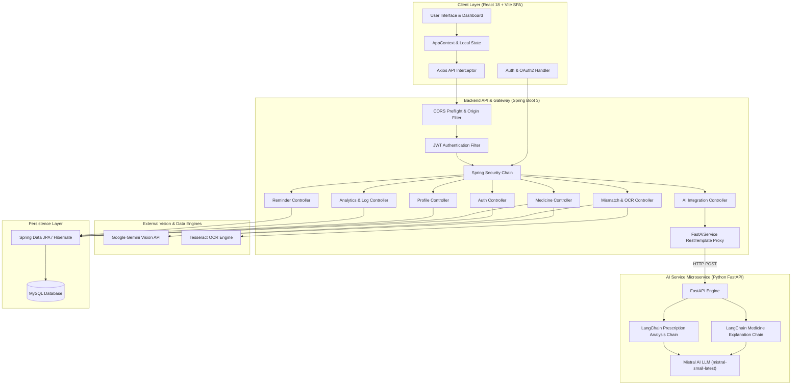

# MedoraX ⚕️ — Intelligent Clinical Medication Coordinator & AI Health Platform

[](https://reactjs.org/)
[](https://www.typescriptlang.org/)
[](https://vitejs.dev/)
[](https://tailwindcss.com/)
[](https://www.oracle.com/java/)
[](https://spring.io/projects/spring-boot)
[](https://www.python.org/)
[](https://fastapi.tiangolo.com/)
[](https://www.langchain.com/)
[](https://www.mysql.com/)
[](LICENSE)

**MedoraX** is a HIPAA-compliant, enterprise-grade medication management and clinical decision-support ecosystem. Built with a high-performance **React + Vite** frontend, a robust **Spring Boot 3 REST API**, and a dedicated **Python FastAPI AI Service** (powered by **LangChain + Mistral AI** and **Google Gemini Vision AI**), MedoraX eliminates prescription mismatch risks, calculates patient adherence metrics, and delivers automated medication reminders.

🌐 **Live Application**: [https://medora-x-five.vercel.app](https://medora-x-five.vercel.app)  
⚙️ **Backend Service**: `http://localhost:8080` / `https://medorax-0.onrender.com`  
🤖 **AI Service (FastAPI)**: `http://localhost:8000`

---

## 🏗️ System Architecture

MedoraX follows a multi-tier microservices architecture combining standard RESTful APIs with decoupled AI inference services.



### Data Flow & Request Lifecycle
1. **Authentication**: Users log in via JWT credentials (`/auth/login`) or Google OAuth2 (`/oauth2/authorization/google`). On OAuth success, the server redirects back to the SPA with signed tokens.
2. **API Interception**: All protected frontend requests attach `Authorization: Bearer <token>` headers via Axios interceptors.
3. **AI Pipeline**:
   - **FastAPI Microservice** (`/api/ai/*`): Handles natural language medicine queries, prescription breakdowns, and AI assistant chats using LangChain chains with Mistral AI.
   - **Multimodal Vision** (`/api/mismatch/check`): OCR extracts text from prescription images, while Gemini AI cross-references physical pill images against user medication profiles.

---

## ✨ Key Features

### 1. 📊 Interactive Dashboard & Adherence Hub
- **Real-Time Streak Tracker**: Computes consecutive compliant intake days without missed doses.
- **Daily Compliance Rate**: Calculates percentage of completed vs. missed doses dynamically.
- **Weekly Adherence Graph**: Interactive Area & Bar charts powered by Recharts.
- **Active Shelf Catalog**: Instant overview of current prescriptions, dosage strengths, and remaining pill counts.

### 2. 📸 AI Prescription Mismatch & OCR Vision Scanner
- **Multimodal AI Analysis**: Scans uploaded physical prescription documents alongside pill packaging.
- **Conflict Identification**: Automatically flags drug mismatches, improper dosage frequencies, and dangerous drug-drug interactions using Google Gemini 1.5 Flash.
- **Automated Fallbacks**: Analyzes raw OCR text if medicine packaging images are omitted.

### 3. 🤖 MedoraX AI Health Assistant (FastAPI + LangChain)
- **Clinical Copilot Assistant**: Interactive AI assistant for answering medical queries, explaining side effects, and verifying food/beverage interactions.
- **Structured Markdown Rendering**: Renders clinical headers, warning callout cards (`⚠️`), and bulleted recommendations cleanly in the UI.
- **FastAPI Proxy**: Spring Boot proxies request payloads seamlessly to the Python FastAPI microservice.

### 4. 🗓️ Intelligent Reminder Timeline & Schedule Engine
- **Horizontal Date Navigator**: 7-day calendar strip allowing historical review and future intake planning.
- **Hourly Medication Timeline**: Chronological event sequence showing exact dosage times, food constraints (*Before Meals, With Food, After Meals*), and administration notes.
- **Compliance Toggles**: One-click action buttons to mark doses as **Taken**, **Missed**, or **Reset**.

### 5. 📈 Analytics & Heatmap Visualization
- **GitHub-Style Compliance Heatmap**: 6-month density matrix visualizing long-term intake consistency.
- **Per-Medication Adherence Rates**: Individual breakdown of compliance percentages across every active treatment.

### 6. 👤 Patient Profile & Emergency Escalation
- **Demographic Vitals**: Blood group, height, weight, and allergy records.
- **Emergency Guardian Contact**: Stores emergency contact details for automated alert escalation.

---

## 🛠️ Technology Stack

| Layer | Technologies |
| :--- | :--- |
| **Frontend Framework** | React 18, TypeScript, Vite 6 |
| **Styling & Design System** | Vanilla CSS, Tailwind CSS 3, Glassmorphism, Dark Mode |
| **Animations & UI Components** | Framer Motion, Lucide Icons, React Hot Toast |
| **Data Visualization** | Recharts (Area, Bar, & Line Charts) |
| **HTTP & State Management** | Axios, React Context API, React Hook Form |
| **Backend Framework** | Java 21, Spring Boot 3.x, Spring MVC, RestTemplate |
| **Security & Auth** | Spring Security 6, JWT (io.jsonwebtoken), Google OAuth2 |
| **AI Microservice** | Python 3.11+, FastAPI, Uvicorn, LangChain, Pydantic |
| **AI Models & LLMs** | Mistral AI (`mistral-small-latest`), Google Gemini 1.5 Flash |
| **Database & ORM** | MySQL 8.0, Spring Data JPA, Hibernate |
| **Build Tools** | Maven (Spring Boot), UV / Pip (Python), Vite (React) |

---

## 📂 Project Directory Structure

```bash
MedoraX/
├── README.md                             # Project Overview & Architecture Guide
├── Ai Service/                           # Python FastAPI AI Microservice
├── app/
│   ├── chains/                           # LangChain chains (explanation & prescription)
│   ├── models/                           # Pydantic Request/Response models
│   ├── prompts/                          # Clinical system prompt templates
│   ├── routes/                           # FastAPI APIRouter endpoints
│   ├── services/                         # LLM invocation services
│   └── main.py                           # FastAPI application entrypoint
├── main.py                               # Root FastAPI runner
├── requirements.txt                      # Python dependencies
├── pyproject.toml / uv.lock              # UV package management
│
├── frontend/                             # React + Vite Frontend Application
│   ├── src/
│   │   ├── api/                          # Axios API clients
│   │   │   ├── ai.api.ts                 # FastAPI AI integration client
│   │   │   ├── analytics.api.ts          # Analytics & Heatmap endpoints
│   │   │   ├── auth.api.ts               # Login, Signup, OAuth endpoints
│   │   │   ├── medicine.api.ts           # Medicine CRUD & AI endpoints
│   │   │   └── mismatch.api.ts           # OCR & Prescription Scanner endpoints
│   │   ├── components/                   # UI components (Header, Sidebar, Cards, Badges)
│   │   ├── context/                      # AppContext global state
│   │   ├── pages/                        # AIAssistant, Dashboard, PrescriptionMismatch, etc.
│   │   └── App.tsx / main.tsx
│   ├── .env                              # VITE_API_BASE_URL config
│   └── package.json
│
└── backend/                              # Spring Boot Java Backend Service
    └── medicineRemainder/
        └── medicineRemainder/
            ├── src/main/java/com/project/medicineRemainder/
            │   ├── Security/             # SecurityConfig, JWT Filter, OAuth2 Handler
            │   ├── controller/           # REST API Controllers (AiIntegrationController, etc.)
            │   ├── dto/                  # AiMedicineRequest, AiChatRequest, etc.
            │   ├── Entity/               # JPA Entities (User, Medicine, Reminder, Log)
            │   └── service/              # FastAiService, GeminiServices, OCRservices, etc.
            ├── src/main/resources/
            │   └── application.properties# Environment configurations & database settings
            ├── run-backend.ps1           # Helper script for running Spring Boot with env vars
            └── pom.xml
```

---

## 📡 REST API Reference

### 🤖 AI Service Integration (`/api/ai`)
| Method | Endpoint | Description | Proxied To |
| :--- | :--- | :--- | :--- |
| `POST` | `/api/ai/chat` | AI Health Assistant chat | FastAPI `POST /chat` |
| `POST` | `/api/ai/explain` | Explain medicine details & side effects | FastAPI `POST /api/medicine/explain` |
| `POST` | `/api/ai/prescription` | Analyze unstructured prescription text | FastAPI `POST /api/prescription/analyze` |
| `GET` | `/api/ai/health` | FastAPI service health check | FastAPI `GET /health` |

### 🔐 Authentication (`/auth`, `/api/auth`)
| Method | Endpoint | Description | Auth Required |
| :--- | :--- | :--- | :---: |
| `POST` | `/auth/signup` | Register a new user account | ❌ |
| `POST` | `/auth/login` | Log in and receive JWT token | ❌ |
| `GET` | `/oauth2/authorization/google` | Trigger Google OAuth2 Sign-In | ❌ |
| `GET` | `/api/auth/me` | Fetch authenticated user details | ✅ |

### 💊 Medicines (`/api/medicines`)
| Method | Endpoint | Description | Auth Required |
| :--- | :--- | :--- | :---: |
| `GET` | `/api/medicines` | Get all active medicines for authenticated user | ✅ |
| `POST` | `/api/medicines` | Add a new medicine item | ✅ |
| `PUT` | `/api/medicines/{id}/taken` | Mark dose as taken today | ✅ |
| `PUT` | `/api/medicines/{id}/missed` | Mark dose as missed today | ✅ |

### 📸 Prescription Scan & Mismatch (`/api/mismatch`)
| Method | Endpoint | Description | Auth Required |
| :--- | :--- | :--- | :---: |
| `POST` | `/api/mismatch/check` | Analyze prescription image against medicine image or name | ❌ |
| `POST` | `/api/mismatch/ocr-only` | Extract raw text via Tesseract OCR | ❌ |

---

## ⚡ Local Setup & Execution Guide

### 1. Clone the Repository
```bash
git clone https://github.com/Rohit-code07/MedoraX.git
cd MedoraX
```

### 2. Start Python FastAPI AI Service
```powershell
cd "Ai Service"

# Option A: Using UV (Recommended)
uv run uvicorn app.main:app --port 8000 --reload

# Option B: Using Pip & Virtual Environment
python -m venv .venv
.\.venv\Scripts\activate
pip install -r requirements.txt
uvicorn app.main:app --port 8000 --reload
```
*AI Service will run on `http://localhost:8000`*.

---

### 3. Start Spring Boot Backend
Navigate to the Spring Boot directory:
```powershell
cd "backend/medicineRemainder/medicineRemainder"
```
Edit credentials in `run-backend.ps1` or export environment variables, then execute:
```powershell
.\run-backend.ps1
```
*Backend API will run on `http://localhost:8080`*.

---

### 4. Start React Frontend Client
Navigate to the `frontend` folder:
```powershell
cd frontend
npm install
npm run dev
```
*Frontend app will run on `http://localhost:5173`*.

---

## 📜 License & Acknowledgements

This project is licensed under the **MIT License** — see the [LICENSE](LICENSE) file for details.

Developed with ❤️ by **[Rohit Verma](https://github.com/Rohit-code07)**.
